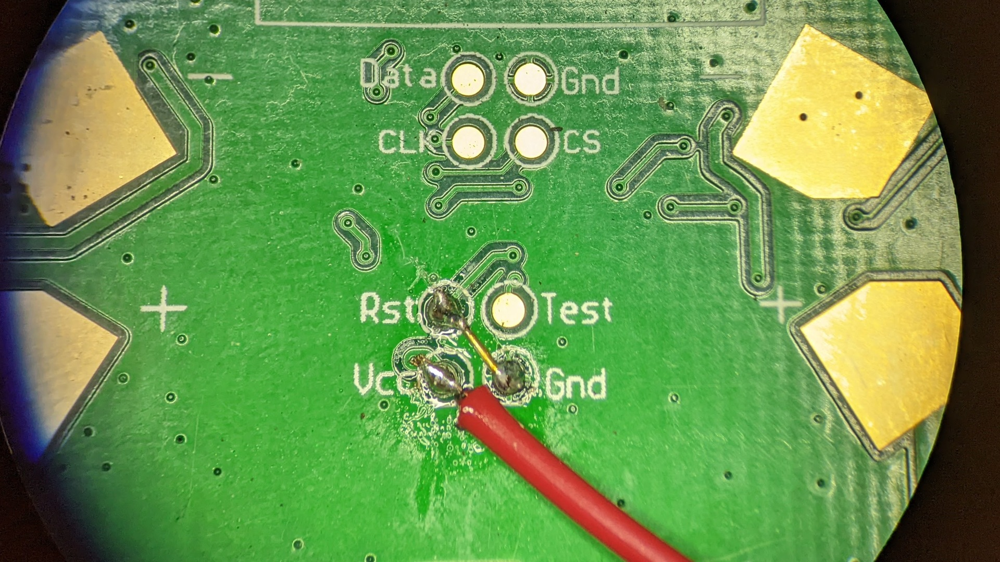
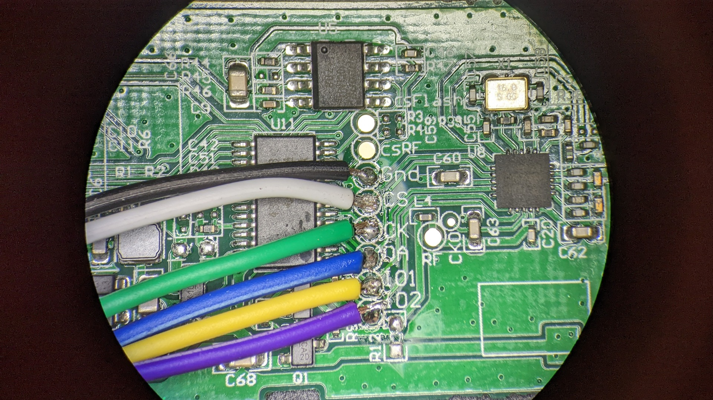

# pya7106: Python library for the A7106 radio module

This library is designed to interface an [Amicom A7106](http://www.amiccom.com.tw/asp/product_detail.asp?CATG_ID=2&PRODUCT_ID=109) 2.4G FSK/GFSK Transceiver with a Rasberry Pi. These are very cheap radios that we found in used E-Ink tags.

## Wiring

Connect the `RST` pin to `GND` so that the MSP430 stays in reset the whole time.
Connect a jumper to the `VCC` pin to supply 3.3V.

Solder jumpers to the six test pads.

Connect the radio to the Pi:

* `VCC` -> 3.3V on the Pi header
* `CS` -> Pi pin 2: Chip Select
* `CK` -> Pi pin 3: Clock
* `DA` -> Pi pin 4: Data from Pi to radio
* `GND` -> Any of the ground pins on the Pi header
* `IO1` -> Pi pin 17: Data from radio to Pi, after configuration
* `IO2` -> Pi pin 27: `WTR` signal from Radio to Pi, high when TX/RX are completed

## References

* Datasheet: https://datasheet.lcsc.com/szlcsc/2001071135_AMICCOM-Elec-A71X06AQFI-Q_C479510.pdf
* Companion library: https://github.com/osresearch/eink-pricetags
* Sample Arduino code: https://www.arduino.cn/thread-49468-1-1.html
* FIFO mode reference code: http://docsplayer.com/134201791-%E5%88%9D%E5%A7%8B%E5%8C%96a7121.html
